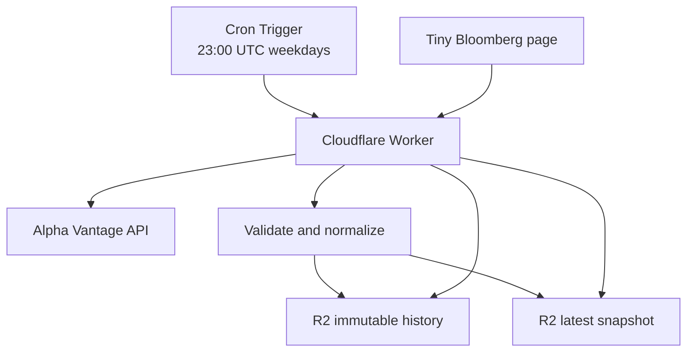

Tiny Bloomberg Stage 1 should prove one thing:

> Market data is collected automatically every day, preserved as history, and displayed on a small dependable page—even when your laptop is off.

## 1. Recommended architecture

Use Cloudflare for the entire first stage. Do not split the system between Cloudflare and AWS yet.



Components:

| Component          | Choice                        | Responsibility                              |
| ------------------ | ----------------------------- | ------------------------------------------- |
| Scheduler          | Cloudflare Cron Trigger       | Starts collection automatically             |
| Collector/API      | Cloudflare Worker, TypeScript | Downloads, validates and serves data        |
| Storage            | Cloudflare R2                 | Stores raw responses and normalized history |
| Frontend           | Cloudflare Pages              | Displays the dashboard                      |
| Market-data source | Alpha Vantage                 | Initial official API                        |
| Monitoring         | Worker logs + health endpoint | Detects failed or stale collection          |
| Source control     | GitHub                        | Code, deployment and change history         |

Why Cloudflare first:

* one platform and one deployment model;
* R2 currently includes 10 GB-month free storage, one million monthly write operations and free internet egress;
* scheduled Workers can run for up to 15 minutes;
* no server, container or permanent process;
* much simpler than your earlier Lambda–API Gateway–ECR route.

The current free Alpha Vantage allowance is 25 requests per day—enough for a carefully limited first universe. [Cloudflare R2 pricing](https://developers.cloudflare.com/r2/pricing/), [Worker limits](https://developers.cloudflare.com/workers/platform/limits/), [Alpha Vantage limits](https://www.alphavantage.co/support/).

## 2. Strict Stage 1 scope

Stage 1 includes:

* one data provider;
* five market instruments;
* one scheduled daily collection;
* durable historical storage;
* several transparent calculated metrics;
* one public read-only dashboard;
* health monitoring;
* manual collection and recovery mechanism;
* documented deployment.

It excludes:

* LLMs;
* investment recommendations;
* news or sentiment;
* intraday streaming;
* user accounts;
* portfolio transactions;
* sophisticated pipelines;
* multiple providers;
* databases;
* AWS;
* machine learning;
* automated trading.

This boundary matters. The first victory is reliability, not breadth.

## 3. Initial market universe

Start with five liquid US-listed ETFs:

| Symbol | Meaning                      |
| ------ | ---------------------------- |
| SPY    | US large-cap market          |
| QQQ    | Nasdaq growth and technology |
| IWM    | US small caps                |
| EEM    | Emerging markets             |
| TLT    | Long-duration US Treasuries  |

This is an engineering test universe, not your final investment universe. It provides different asset behaviours while staying within one straightforward data API.

After the mechanism proves reliable, we can replace or extend these with your actual holdings and European UCITS listings.

## 4. Data collected

For every symbol, retain the provider’s daily OHLCV data:

```json
{
  "symbol": "SPY",
  "marketDate": "2026-08-17",
  "collectedAt": "2026-08-17T23:00:08Z",
  "source": "alpha_vantage",
  "currency": "USD",
  "open": 650.20,
  "high": 654.40,
  "low": 649.80,
  "close": 653.10,
  "adjustedClose": 653.10,
  "volume": 63500210
}
```

Calculate these simple metrics ourselves:

* latest adjusted close;
* daily return;
* 5-trading-day return;
* 20-trading-day return;
* year-to-date return;
* 20-day volatility, annualised;
* distance from 50-day high;
* data age.

Formulas must be kept in code and documented. Alpha Vantage supplies observations; Tiny Bloomberg calculates the metrics.

No prediction, signal or “buy/sell” label in Stage 1.

## 5. Storage design

R2 bucket: `tiny-bloomberg-data`

```text
raw/
  alpha-vantage/
    2026/
      08/
        17/
          SPY.json
          QQQ.json

snapshots/
  2026/
    08/
      17.json

series/
  SPY.json
  QQQ.json
  IWM.json
  EEM.json
  TLT.json

system/
  latest.json
  health.json
  runs/
    2026-08-17T23-00-00Z.json
```

Rules:

1. `raw/` is immutable—the exact provider response.
2. `snapshots/` is immutable—our normalized daily result.
3. `series/` is a convenient, replaceable dashboard projection.
4. `latest.json` makes the homepage fast.
5. Every run receives its own audit record.
6. Re-running a date must not create duplicate market observations.

The immutable snapshots are the source of truth. Everything else can later be rebuilt from them.

## 6. Collection workflow

The Cron Trigger runs Monday–Friday at 23:00 UTC.

For each symbol:

1. Request daily adjusted data.
2. Check HTTP status.
3. Detect API error and rate-limit messages.
4. Save the raw response.
5. Validate required fields and number formats.
6. Determine the latest market date.
7. Reject dates in the future.
8. Check whether that market date already exists.
9. Normalize the observation.
10. Update the bounded series file.
11. Calculate metrics.
12. Update `latest.json`.
13. Write the collection-run report.

A market holiday is not an error. If the provider returns the previously stored market date, the collector records a successful no-change run.

One failed symbol must not destroy the entire batch. The other four should still be stored.

## 7. Reliability rules

“Always working” does not mean failures never happen. It means failures are visible and recoverable.

Implement these safeguards:

* **Idempotency:** rerunning the collector cannot duplicate data.
* **Timeouts:** each external request has a fixed timeout.
* **Retries:** retry temporary failures twice with short backoff.
* **Validation:** never publish malformed data as current data.
* **Partial success:** process symbols independently.
* **Last-known-good data:** the page remains usable after a failed collection.
* **Freshness warning:** mark data stale after two expected collection windows.
* **Run journal:** every collection attempt produces a status record.
* **Secret isolation:** API key exists only as a Worker secret.
* **Manual recovery:** protected endpoint or CLI command can rerun collection.
* **No silent gaps:** health endpoint identifies missing symbols and dates.

Use structured logs such as:

```json
{
  "event": "collection_completed",
  "runId": "2026-08-17T23-00-00Z",
  "requested": 5,
  "succeeded": 5,
  "failed": 0,
  "latestMarketDate": "2026-08-17",
  "durationMs": 4120
}
```

## 8. Worker endpoints

Public:

```text
GET /api/latest
GET /api/history?symbol=SPY&days=100
GET /api/health
```

Protected:

```text
POST /api/admin/collect
POST /api/admin/rebuild-series
```

The protected endpoints require an administrative bearer secret. The frontend never receives either the market-data key or administrative key.

Example health response:

```json
{
  "status": "healthy",
  "lastSuccessfulRun": "2026-08-17T23:00:08Z",
  "latestMarketDate": "2026-08-17",
  "symbolsExpected": 5,
  "symbolsCurrent": 5,
  "staleSymbols": [],
  "failedSymbols": []
}
```

## 9. First dashboard

Keep it compact and serious.

### Header

* Tiny Bloomberg
* last successful update;
* latest market date;
* green, amber or red system status.

### Market table

| Symbol | Price | 1D | 5D | 20D | YTD | 20D volatility | From 50D high |
| ------ | ----: | -: | -: | --: | --: | -------------: | ------------: |

### Instrument detail

Clicking a row opens:

* instrument name;
* latest metrics;
* approximately 100 daily observations;
* simple close-price line chart;
* source and timestamp.

Use plain HTML, CSS and TypeScript. A native SVG chart is sufficient. Avoid a heavy UI framework for this stage.

The page must work cleanly on your iPhone as well as desktop.

## 10. Repository structure

```text
tiny-bloomberg/
  README.md
  package.json
  wrangler.jsonc

  src/
    worker.ts
    config.ts

    collector/
      alpha-vantage.ts
      collect.ts
      normalize.ts
      validate.ts

    metrics/
      returns.ts
      volatility.ts
      drawdown.ts

    storage/
      keys.ts
      repository.ts

    api/
      latest.ts
      history.ts
      health.ts
      admin.ts

    types/
      market.ts
      provider.ts
      system.ts

  web/
    index.html
    styles.css
    app.ts

  test/
    fixtures/
    normalize.test.ts
    metrics.test.ts
    idempotency.test.ts
    health.test.ts

  docs/
    architecture.md
    data-contract.md
    operations.md
```

## 11. Testing requirements

Unit tests:

* Alpha Vantage normalization;
* percentage-return calculations;
* annualised volatility;
* missing fields;
* provider error messages;
* duplicate market date;
* holiday/no-change response;
* one-symbol failure;
* stale-data classification.

Integration test:

1. Load a saved provider fixture.
2. Run collection against a test bucket.
3. Verify raw file.
4. Verify normalized snapshot.
5. Verify series update.
6. Call `/api/latest`.
7. Verify dashboard contract.

Do not make automated tests consume the real API allowance. Use recorded fixtures.

## 12. Implementation sequence

### Day 1 — Sunday, 16 August: foundation

Target: one real symbol stored successfully.

1. Create GitHub repository.
2. Create Cloudflare Worker project in TypeScript.
3. Create R2 bucket.
4. Obtain Alpha Vantage key.
5. Save the key as a Worker secret.
6. Implement collection for SPY only.
7. Save raw and normalized JSON.
8. Deploy.
9. Confirm the data exists after deployment.
10. Commit a working checkpoint.

**Definition of done:** an online Worker downloads SPY data and stores it in R2.

### Day 2 — normalization and history

Target: trustworthy data contracts.

* define TypeScript types;
* implement validation;
* add all five symbols;
* create immutable daily snapshots;
* implement idempotency;
* add fixture-based tests.

### Day 3 — scheduler and health

Target: autonomous operation.

* configure weekday Cron Trigger;
* add run journal;
* add `/api/health`;
* implement stale-data rules;
* add manual protected collection;
* perform two manual reruns to prove idempotency.

### Day 4 — metrics API

Target: useful information.

* implement returns;
* implement volatility;
* implement distance from high;
* produce `latest.json`;
* expose `/api/latest` and `/api/history`.

### Day 5 — dashboard

Target: visible Tiny Bloomberg.

* create responsive page;
* add status header;
* add market table;
* add detail chart;
* deploy through Cloudflare Pages.

### Day 6 — failure testing

Target: recoverability.

Deliberately simulate:

* invalid API key;
* provider timeout;
* rate-limit response;
* malformed JSON;
* one missing symbol;
* duplicate market date;
* market holiday.

Verify that the last valid dashboard remains available.

### Day 7 — operational finish

Target: Stage 1 production baseline.

* write deployment instructions;
* write recovery procedure;
* add architecture diagram;
* verify seven-day storage structure;
* check Cloudflare usage;
* tag release `v0.1.0`.

## 13. Stage 1 completion criteria

Stage 1 is complete only when:

* collection runs without your computer;
* it has succeeded automatically on at least five expected market days;
* raw and normalized history are preserved;
* rerunning does not create duplicates;
* the dashboard reports its freshness;
* a failed provider request does not erase valid data;
* the API key is not visible in code, GitHub or the browser;
* manual recovery is documented and tested;
* operating cost remains zero under the current free limits;
* you can explain every component and metric yourself.

## 14. Your first 90-minute session tomorrow

Do only this:

1. Create `tiny-bloomberg`.
2. Initialize the Cloudflare TypeScript Worker.
3. Create and bind the R2 bucket.
4. Add the API key as a secret.
5. Fetch SPY.
6. Store the raw response.
7. Store one normalized record.
8. retrieve that record through `/api/latest`.
9. Commit and stop.

Do not build the dashboard tomorrow until this vertical slice works:

> API → Worker → R2 → API response.

That small working spine is the beginning of the entire future platform.
https://github.com/michalkordyzon/tiny-bloomberg